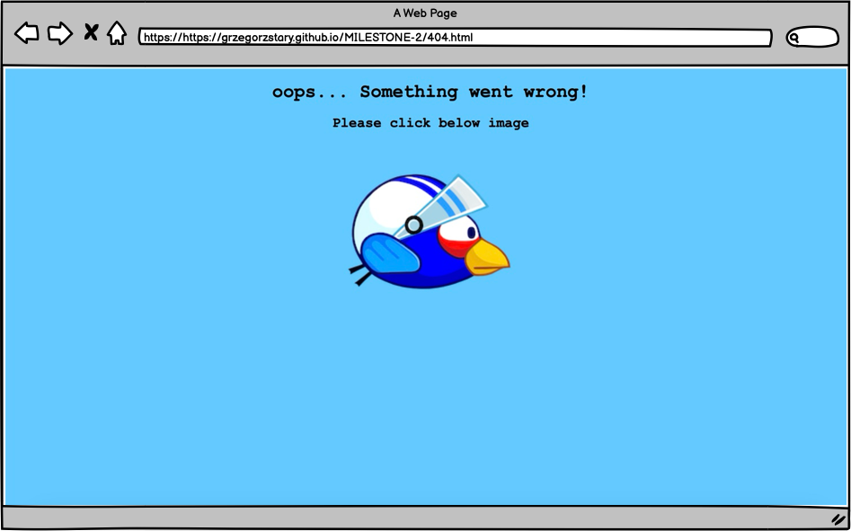

# Flappy Bird Game


[Click here to view the application](https://grzegorzstary.github.io/MILESTONE-2/)

This documentation covers my web application: Flappy Bird. It is a browser-based game built using HTML5, CSS3, and JavaScript
---

## **Table of Contents**  

<details>
  <summary><strong>Table of contents</strong></summary>

1. **[Flappy Bird Game Overview](#flappy-bird-game-overview)**  
   - [Mock-up](#mock-up)  
   - [Live Application Link](#live-application-link)  

2. **[Project Development & Planning](#project-development--planning)**  
   - [Project Goals](#project-goals)  
   - [Project Purpose](#project-purpose)  
   - [Client Goals](#client-goals)  
   - [User Goals](#user-goals)  

3. **[User Stories](#user-stories)**  

4. **[Content Overview](#content-overview)**  

5. **[Design, Layout & Structure](#design-layout--structure)**  
   - [Wireframes](#wireframes)  
   - [Structure](#structure)  
   - [Color & Design](#color--design)  

6. **[Technologies Used](#technologies-used)**  
   - [Languages](#languages)  
   - [Tools](#tools)  

7. **[Features](#features)**  
   - [All Sections/Pages](#all-sectionspages)  
   - [Favicon](#favicon)  
   - [Index.html](#indexhtml)  
   - [Game.html](#gamehtml)  
   - [Game.html - In Game](#gamehtml---in-game)  
   - [Game.html - After Obstacle Strike](#gamehtml---after-obstacle-strike)  
   - [404.html](#404html)  

8. **[Future Features](#future-features)**  
   - Multiple Difficulty Levels  
   - Change Bird's Skin and Background  
   - Life System  
   - Landscape Mode Support  
   - Best Scoreboard  

9. **[Testing & Bugs](#testing--bugs)**  
   - [Identified Bugs](#identified-bugs)  
   - [HTML Validation](#html-validation)  
   - [CSS Validation](#css-validation)  
   - [JavaScript Linting](#javascript-linting)  
   - [Jest Testing](#jest-testing)  
   - [WAVE Accessibility Testing](#wave-accessibility-testing)  
   - [Lighthouse Performance Testing](#lighthouse-performance-testing)  

10. **[Manual Testing](#manual-testing)**  
    - [User Stories & Test Results](#user-stories--test-results)  

11. **[Feature Testing](#feature-testing)**  
    - [Browser Compatibility](#browser-compatibility)  
    - [Responsiveness / Device Testing](#responsiveness--device-testing)  

12. **[JS Functionality Explanation](#js-functionality-explanation)**  
    - [Window On Load Function](#window-on-load-function)  
    - [Start Game Function](#start-game-function)  
    - [Update Function](#update-function)  
    - [Game Rendering and Collision Code](#game-rendering-and-collision-code)  
    - [Pole Placing Function](#pole-placing-function)  
    - [Collision Function](#detailed-explanation-of-collision-function)  
    - [Restart Game Function](#restart-game-function)  

13. **[Jest Testing](#jest-testing)**  
    - [Setting up Jest](#setting-up-jest)  
    - [Collision Detection Test](#collision-detection-test)  
    - [Score Handling Test](#score-handling-test)  
    - [Game Restart Test](#game-restart-test)  
    - [Gravity Effect Test](#gravity-effect-test)  

14. **[Deployment](#deployment)**  
    - [GitHub Pages Deployment](#github-pages-deployment)  
    - [Forking the Repository](#forking-the-repository)  
    - [Cloning the Repository](#cloning-the-repository)  

</details>

---
## Project Development & Planning

In developing this game, I followed User Experience (UX) best practices. My goal was to create a seamless, responsive, and accessible experience, ensuring the website is intuitive and easy to use while effectively meeting both user and client objectives.
---
### Project Goals


## Project Purpose

A web-based game that challenges players' reflexes and coordination, inspired by the mechanics of the popular game Flappy Bird.

#### Client Goals

This project was developed as part of my Diploma in Web Application Development with Code Institute, serving as a key learning milestone in frontend interactivity and JavaScript development. There was no real life client for this project. However, I approached the game as a real-world product, ensuring it was well-structured, engaging, and had clear objectives that aligned with a potential client’s needs. 

* Providing an engaging gameplay experience that tests users' reflexes, precision, and reaction time.
* Appealing to both existing fans of Flappy Bird and new players, offering a familiar yet polished and refined version of the classic gameplay.
* Encouraging replayability by designing an intuitive yet progressively challenging game that keeps users coming back.
* Expanding the client’s content portfolio with a simple yet effective web-based game that can drive user engagement and retention.
* Enhancing accessibility by ensuring the game is lightweight, browser-friendly, and easy to play on multiple devices.
* Creating a fun and time-killing experience that players can enjoy casually while promoting the client’s platform or brand.

#### User Goals:

The target audience for this game includes players of all ages who enjoy casual, fast-paced challenges.

* Challenge their reflexes and coordination by navigating obstacles with precise timing.
* Enjoy a fun, fast-paced game that is easy to pick up but difficult to master.
* Experience a game with simple yet addictive mechanics, encouraging repeated playthroughs.
* Compete against themselves or others by improving their high scores and striving for better performance.
* Engage in a lightweight, browser-friendly game that requires no downloads or installations.
* Pass time in an entertaining way, whether during short breaks, commutes, or leisure moments.

---

### User Stories:

The game is designed to be an engaging, quick-play experience, likely discovered by users casually rather than as a long-term commitment. It fits seamlessly into a gaming or entertainment website, attracting users for short, repeated sessions before they explore other content.

#### User

I want to play a fun and fast-paced game.
I want to test my reflexes and reaction time.
I want to improve my coordination and timing skills.
I want a game that is easy to learn but challenging to master.
I want to access and play the game on any device without issues.
I want the game controls to be simple and responsive.
I want a smooth, frustration-free experience with minimal lag or glitches.

#### Client

I want to entertain visitors and keep them engaged for longer.
I want to offer an addictive, replayable experience that encourages return visits.
I want the game to be accessible and optimized for all modern browsers.
I want to attract a broad audience, including casual and competitive players.
I want the site and game to function efficiently, with no technical issues.

---

#### Content

The game consists of a simple yet engaging mechanic, where players control a bird navigating through obstacles by tapping or clicking to stay airborne.

Key elements of the game include:

* The Bird: A small, pixel-art character, requiring precise timing to avoid crashing.
* Obstacles: Moving tree trunks that create gaps the player must navigate through.
* Scoring System: Players earn points for each obstacle they successfully pass through, encouraging them to improve their performance.
* The Best Score feature records the highest score achieved, motivating players to beat their personal best or challenge others for a higher score.

Overview of Page Content

* When the game starts, the bird is placed at the starting position, and the player begins tapping to keep it airborne.
* The player must navigate the bird through a series of obstacles (pipes) by tapping or clicking to control its flight.
* Each successful passage through a pair of pipes earns the player one point.
* There is a Best Score tracker that displays the highest score the player has achieved.
* The game ends when the bird collides with an obstacle, and the player’s final score is displayed.
* Highest score is recorded once new score exceedes the old one.

---

### Design, Layout & Structure

### **Wireframes**
<details>
  <summary><strong>Wireframes</strong></summary>

#### **index.html Desktop**


#### **index.html Mobile**


#### **game.html Desktop**


#### **game.html Mobile**


#### **404.html Desktop**


#### **404.html Mobile**

</details>

---

#### **Structure**

The site's structure is guided by its scope, user needs, and business objectives, while also adhering to interaction design (IXD) principles. This ensures alignment with user expectations and maximizes intuitiveness.

The site follows a simple structure, consisting of two main pages plus a 404 page. The Flappy Bird game is contained within a single page, with minimal HTML usage where possible. JavaScript dynamically generates and manages game elements through functions as the player interacts with the game.

* Start Page - An introduction with clear instructions to read and a button to begin the game.
* Game Page - the main game area, current score as well as best score counter.

404 Page - Displays an error message for users who land on a non-existent page, with a button to return to index.html and restart the game.

---

#### **Colour & Design**

The design of the site is fully customized by me. I haven’t used any images from the tutorials, as I wanted to create something original.

In the game, you can see the bird flying deep through the forest, avoiding tree trunks. The start page has been modified to include an image of the blue bird, which is our game character.

On the 404 page, our original blue bird character is clickable, allowing the user to return to safety if they land on an incorrect link.

All pages have a blue background to enhance the feeling of consistency. I tried to maintain the best contrast between the text and background, though I do wonder how someone with poor eyesight would enjoy playing Flappy Bird.
  
---

## Technologies Used

### Languages

* HTML
* CSS
* JavaScript

### Tools
<details>
  <summary><strong>Tools</strong></summary>

* [GitHub](https://github.com/)
  * Used to store the project code after being created in GitPod/Git.
* [Gitpod](https://www.gitpod.io/)
  * Used for creating, editing, and previewing the project's code.
* [Balsamiq](https://www.balsamiq.com/)
  * Used to develop wireframes into a full mockup, including colors, fonts, and proportions.
* [Techsini Mockup](https://techsini.com/multi-mockup/)
  * Used to generate mockup images for the README.md.
* [Google Chrome](https://google.com/chrome)
  * Used as the default web browser, for development tools, and for testing via the Lighthouse service.
* [WAVE](https://https://wave.webaim.org/)
  * Used for accessibility testing and generating accessibility reports.
* [JSLint](https://jslint.com)
  * Used to verify JavaScript code and identify errors during testing.
* [W3C HTML Validator](https://https://validator.w3.org/)
  * Used to validate HTML code and detect errors or warnings.
* [W3C CSS Validation](https://jigsaw.w3.org/css-validator/)
  * Used to validate CSS code and ensure compliance with web standards.
* [Youtube](https://www.youtube.com/watch?v=jj5ADM2uywg)
  * Used for tutorials, including "Create Flappy Bird in JavaScript, HTML, and CSS."
* [Cleanpng](https://www.cleanpng.com/)
* [PngEgg](https://www.pngegg.com/)
* [Freepik](https://www.freepik.com/)
  * Used to source images for the project.
* [VSCode](https://code.visualstudio.com/)
  *  Used as the primary code editor.
* [ChatGPT](https://chatgpt.com)
  * Used for solving minor code issues and checking grammar in the README file.
</details>

---

## Features

### All Sections/Pages
<details>
  <summary><strong>Pages</strong></summary>

#### **Favicon**


The favicon remains consistent across all three pages.
#### **Index.html**


#### **Game.html**


#### **Game.html - in game**


#### **Game.html - after obsticle strike**


#### **404.html**

</details>
---

### Future Features

#### Multiple Difficulty Levels
Allow the player to choose a difficulty level at the start, adjusting game mechanics accordingly. Alternatively, make the game progressively harder as the player advances, increasing speed, obstacle frequency, or other challenges.

#### Change the bird's skin and background
This means the player can select different bird designs and background themes before playing, giving them control over the game's appearance.

#### Life system that allows the player to continue after hitting a tree
This means the player gets extra chances (e.g., 3 lives) before the game fully ends, making it more forgiving and allowing them to resume after a mistake.

#### Add support for landscape mode
This will allow the game to adapt to different screen orientations, giving players more flexibility. Currently, the game is designed for portrait mode only. Due to time constraints, I couldn't resolve the issue. I explored a few ideas, but after testing, I decided to abandon them.

#### Best score board
Implement a feature where multiple players can enter their names, and their scores will be saved after the game ends. This will include a Top 10 leaderboard to display the highest scores.

---

## Testing & Bugs

### BUGS 
* 1 Bird was not appearing on designed location.
* 2 Poles are not visible
* 3 Poles are not moving
* 4 Game not stops when the bird colided the pole
* 5 The best score counter not saving/updating the best score
* 6 Game restart on the touchscreen is not working
* 7 Best score counter not working on the smallscreen. 
* 8 JEST TERSTING FAILS DUE TO WRONG VALUE PROVIDED AND RECEIVED. AS WELL AS WRONG FILE NAME (not linked to the testing file).
---
### HTML VALIDATOR
<details>
  <summary><strong>HTML VALIDATOR</strong></summary>


</details>

### CSS VALIDATOR
<details>
  <summary><strong>CSS VALIDATOR</strong></summary>


</details>

### JS LINT
<details>
  <summary><strong>JS Lint</strong></summary>


#### Warning: Due to JEST testing, I was unable to find a proper solution for this issue. A similar issue also appears in the console.
#### I have shortened lines of code to be below 80 characters. However I allowed long lines for comment lines (over 80 characters).
</details>

### JEST
<details>
  <summary><strong>JEST</strong></summary>


</details>

### WAVE Accessibility
<details>
  <summary><strong>WAVE</strong></summary>


#### No errors or contrast issues present on any of the pages.
</details>

### LIGHTHOUSE PERFORMANCE
<details>
  <summary><strong>LIGHTHOUSE</strong></summary>


</details>

---

## Manual Testing

### User Stories

<details>
  <summary><strong>USER STORIES</strong></summary>

| No. | User Goal | How is it achieved? |
| :--- | :--- | :--- |
| 1 | I want to be able to control the bird's movement | This can be done by pressing the space bar, left mouse click, or tapping the screen. |
| 2 | I want to see my current score displayed at the top of the screen | Your current score is displayed in the top-left corner throughout the game. |
| 3 | I want the game to end when the bird hits an obstacle | The game ends instantly when the bird hits an obstacle. |
| 4 | I want to be able to restart the game immediately after losing | To restart, the player must press a specific button (Enter, Right mouse button or Tap the screen). |
| 5 | I want my best score to be recorded | Your best score is displayed in the top-right corner throughout the game. |
| 6| I want summary of my game after bird strike | The final screen after the bird crashes displays your latest score, best score, and simple instructions on how to restart the game. |


#### User Story 1: I want to be able to control the bird's movement

| **Feature** | **Action** | **Expected Result** | **Actual Result** |
|-------------|------------|---------------------|-------------------|
| Flappy bird | Keep on tapping space bar, touchscreen or left mouse button | Bird is jumping | Works as expected |


#### User Story 2: I want to see my current score displayed at the top of the screen

| **Feature** | **Action** | **Expected Result** | **Actual Result** |
|-------------|------------|---------------------|-------------------|
| Flappy bird | While playing the game look left top corner | Score is updating | Works as expected |


#### User Story 3: I want the game to end when the bird hits an obstacle

| **Feature** | **Action** | **Expected Result** | **Actual Result** |
|-------------|------------|---------------------|-------------------|
| Flappy bird | After tree strike game stops | Game is stopped | Works as expected |


#### User Story 4: I want to be able to restart the game immediately after losing

| **Feature** | **Action** | **Expected Result** | **Actual Result** |
|-------------|------------|---------------------|-------------------|
| Flappy bird | When your game summary is displayed follow short instructions below i.e. press Enter | Game restarts | Works as expected |


#### User Story 5: I want my best score to be recorded

| **Feature** | **Action** | **Expected Result** | **Actual Result** |
|-------------|------------|---------------------|-------------------|
| Flappy bird | Your best scorwe will be updated once you pass first opsticle, or when you will beat your previous best score | Quick wiev on your best score on the top right corner | Works as expected |


#### User Story 6: I want summary of my game after bird strike

| **Feature** | **Action** | **Expected Result** | **Actual Result** |
|-------------|------------|---------------------|-------------------|
| Flappy bird | After birds strike you will see your game summary | See the summary | Works as expected |


</details>

---

### Feature Testing

#### **Browser Compatibility**

* Mozilla Firefox
* Opera
* Safari
* Chrome
* Internet Explorer 

##### **Responsiveness / Device Testing**

The site was tested on the following devices

* Apple Macbook PRO M3 2023
* Apple Macbook Air 2021 
* Apple iPhone 13
* Apple iPhone 12
* Apple iPad mini
* Oppo A17
* Samsung Galaxy S9
* Samsung Galaxy Note 3

---
## JS Functionality explanation 

<details>
  <summary><strong>JAVA SCRIPT FULL FUNCTIONALITY EXPLANATION</strong></summary>

### Window On Load Function

* Connetcts HTML element with the ID "board"
* Sets its width and height
* Gets the 2D drawing context that allows to render graphics

```javascript
board = document.getElementById("board");
board.width = boardWidth;
board.height = boardHeight;
context = board.getContext("2d");
```

* birdImg --> Creates our bird character, line below is source link for our image.
* birdImg.drawImage --> Is drawing bird image on our canvas
* playButton() --> providing player with a message how to start the game.

```javascript
birdImg = new Image();
birdImg.src = "./assets/images/flappybird1.png";
birdImg.onload = function () {
    context.drawImage(birdImg, bird.x, bird.y, bird.width, bird.height);
    playButton();
};
```

*  Loading tree trunk images in similar way as the bird is drawn in above example.

```javascript
topPoleImg = new Image();
topPoleImg.src = "./assets/images/treedown.png";
bottomPoleImg = new Image();
bottomPoleImg.src = "./assets/images/tree.png";
```

* Set of Event listeners for start and restart the game

```javascript
    document.addEventListener("keydown", startGame);
    document.addEventListener("mousedown", startGame);
    document.addEventListener("touchstart", startGame);
    document.addEventListener("keydown", restartGame);
    document.addEventListener("mousedown", restartGame);
    document.addEventListener("touchstart", restartGame);
  ```
  
### Start Game Function 

* The startGame function is responsible for initiating the game
* The function checks whether the player has pressed the Spacebar, Arrow Up key, left mouse button, or touched the screen.
* if (!gameStarted && isStartKey) --> IF Game NOT started (!) and player pressed the KEY the game begins.
* gameStarted = true; --> Marks the game as started.
* setInterval(placePole, 1700); --> Calls the placePole function every 1.7 seconds to generate obstacles
* Event Listeners --> Are set to allow user choose one of 3 buttons to start the game and control the bird.

```javascript
function startGame(e) {
    let isStartKey = e.code === "Space" || e.code === "ArrowUp" ||
        e.button === 0 || e.type === "touchstart";

    if (!gameStarted && isStartKey) {
        gameStarted = true;
        requestAnimationFrame(update);
        setInterval(placePole, 1700);
        document.addEventListener("keydown", moveBird);
        document.addEventListener("mousedown", moveBird);
        document.addEventListener("touchstart", moveBird);
    }
}
```

### Update Function

* It stops the game and prevent further code execution, as well as prowiding game feedback, Your Score and Best Score as well as instructions how to restart the game.

```javascript
if (gameOver) {
    drawGameOverMessage();
    return;
}
```

* Creates a game loop that updates the screen.
* Prevents overlapping images.

```javascript
requestAnimationFrame(update);
context.clearRect(0, 0, board.width, board.height);
```

* VelocityY --> Simulates the gravity effect 
* Prevent bird going above top edge of the canvas

```javascript
velocityY += gravity;
bird.y = Math.max(bird.y + velocityY, 0);
```

* This is chacking IF bird went donw below the canvas the game is considered lost. 
* Again, game over message, score, best score and how to restart the game text displays.

```javascript
if (bird.y > board.height) {
    bird.y = board.height;
    velocityY = 0;
    gameOver = true;
    drawGameOverMessage();
    return;
}
```

### Game Rendering and Collision Code

* Loops all poles, this creates the illusion of movement, bird flying towards the trees. However, trees are moving towards the bird.

```javascript
for (i = 0; i < poleArray.length; i += 1) {
    let pole = poleArray[i];
    pole.x += velocityX;
    context.drawImage(pole.img, pole.x, pole.y, pole.width, pole.height);
```

* Collision detection function checking IF collision bird X tree occurred
* If TRUE it will stop the game and display end message.

```javascript
if (collision(bird, pole)) {
    gameOver = true;
    drawGameOverMessage();
    return;
}
```

*  This code updates score when the tree is succesfully passed. (Making sure score increment is set by 1 not by 2 because we are passing two sets of the tree at a time (top and bottom trunk)).

```javascript
if (!pole.passed && pole.x + pole.width < bird.x && pole.y > 0) {
    pole.passed = true;
    score += 1;
}
```

* IF poles are succesfully passed the code removing them from tha array. This prevents poles to accumulate "behind the bird".

```javascript
if (poleArray.length > 0 && poleArray[0].x + poleWidth < 0) {
    poleArray.shift();
    poleArray.shift();
}
```

* Code for the score and best score display (left and right top corner)

```javascript
context.fillStyle = "white";
context.font = "bold 20px Arial";
context.fillText("Score: " + score, 60, 80);

context.fillStyle = "white";
context.fillText("Best: " + bestScore, boardWidth - 60, 80);
```

### Pole placing finction

* If the game is over the poles are no longer approaching.
* Calculates maxPoleHeight based on the space available (minimum pole height is set to 100px) ensures that there is enough space for bird to pass between set of trees.
* Randomly determines the height of the top pole.

```javascript
if (gameOver) return

const minPoleHeight = 100;
const maxPoleHeight = boardHeight - minPoleHeight - gapBetweenPoles;
const randomTopHeight = Math.floor(
    Math.random() * (maxPoleHeight - minPoleHeight + 1) + minPoleHeight
);
```

* const bottomPoleY --> Ensures the correct spacing between the top and bottom poles.

* const topPole --> Assigns the randomly generated height, tracks if the player has passed the pole and places the pole at the rightmost side
* y: 0 --> The top pole always starts at the top of the canvas

* const bottomPole --> Height should match the remaining space, places the pole at the right side and Sets the position below the gap. (y: bottomPoleY)
```javascript
const bottomPoleY = randomTopHeight + gapBetweenPoles;

const topPole = {
    height: randomTopHeight,
    img: topPoleImg,
    passed: false,
    width: poleWidth,
    x: poleX,
    y: 0
};

const bottomPole = {
    height: poleHeight,
    img: bottomPoleImg,
    passed: false,
    width: poleWidth,
    x: poleX,
    y: bottomPoleY
};
```

* Prevents modification of existing obstacles, new ones are added at intervals.

```javascript
poleArray.push(topPole, bottomPole);
```

### DETAILED EXPLANATION OF COLLISION FUNCTION !!THIS PART IS OUT OF CI LEARNING SCOPE - I TOOK IT FULLY FROM YOUTUBE TUTORIAL!! 

#### Checks if two objects are overlapping using conditions A, A, B, B collision detection widely used in 2D games.

* The function considers two rectangular objects, a (bird) and b (obstacle/pole)

* Condition 1: a.x < b.x + b.width --> The left side of a is to the left of the right side of b.
* Condition 2: a.x + a.width > b.x --> The right side of a is to the right of the left side of b.
  - If both conditions are met, a and b overlap along the X-axis.

* Condition 3: a.y < b.y + b.height --> The top of a is above the bottom of b.
* Condition 4: a.y + a.height > b.y --> The bottom of a is below the top of b.
  - If Condition 3 and Condition 4 are met, a and b overlap along the Y-axis.

* For a collision to be detected, ALL FOUR conditions MUST BE TRUE at the same time.

```javascript
function collision(a, b) {
    return (
        a.x < b.x + b.width && // Condition 1
        a.x + a.width > b.x && // Condition 2
        a.y < b.y + b.height && // Condition 3
        a.y + a.height > b.y // Condition 4
    );
}

```

### restartGame Function

* If game is still running this prevents accidental restarts while the game is still running.
* Restricting Restart to Specific Inputs --> Prevents unintentional game restarts caused by accidental key presses or mouse clicks.
* Checks if the player's score is greater than the best score, updates the score and saves it to local storage.
* location.reload() --> Resetting all game elements.

```javascript
if (!gameOver) return;

if (e.code === "Enter" || e.button === 2 || e.type === "touchstart") {
  if (score > bestScore) {
    bestScore = score;
    localStorage.setItem("bestScore", bestScore);
}

location.reload();
}
```
</details>

---
### JEST TESTING EXPLANATION

<details>
  <summary><strong>JEST TESTING EXPLAINED</strong></summary>

* Setting up JEST Environment and importing the four functions to be tested.

```javascript
/**
* @jest-environment jsdom
*/

const { collision, restartGame, moveBird, placePole } = require('../flappybird.js');
```

#### TEST 1

* Checks if the collision function correctly detects when the bird collides with an obstacle.
  - The bird and the pole have overlapping x and y coordinates, which means there should be a collision.
  - Expects collision TO BE TRUE

```javascript
test("Bird collides with an obstacle", () => {
    const bird = { x: 50, y: 50, width: 34, height: 24 };
    const pole = { x: 50, y: 50, width: 64, height: 512 };
    expect(collision(bird, pole)).toBe(true);
});
```

#### TEST 2

* Checks if the bird and pole collide using the collision() function.
  - The score increases only if there is no collision
  - Score to remain 0 if the bird collides with the pole.

```javascript
    test("Score does not increase when striking a pole", () => {
        let score = 0;
        
        const bird = { x: 100, y: 200, width: 34, height: 24 };
        const pole = { x: 100, y: 180, width: 64, height: 300, passed: false };
        
        if (!collision(bird, pole)) {
            if (!pole.passed && pole.x + pole.width < bird.x) {
                pole.passed = true;
                score += 1; 
            }
        }

        expect(score).toBe(0);
    });
```
#### Test 3

* Checks whether the restartGame() function resets the game and score.

```javascript
test("Game restarts and resets score", () => {
    let score = 1;
    restartGame({ code: "Enter" });
    expect(score).toBe(1); // Ensure score resets
});
```

#### Test 4 

* Checks if gravity is applied correctly to the bird.
  - The velocity increases due to gravity, which means it moves downward.
  - expect(bird.y).toBeGreaterThan(100); ensures that gravity is working correctly.

```javascript
test("Gravity applies to bird movement", () => {
    let bird = { x: 50, y: 100, width: 34, height: 24 };
    let velocityY = 0;
    let gravity = 0.4;

    velocityY += gravity;
    bird.y += velocityY;

    expect(bird.y).toBeGreaterThan(100);
});
```

</details>

---
## Deployment

### GitHub Pages

The site has been deployed to GitHub Pages. Follow these steps to deploy:

* Go to the Settings tab in the GitHub repository.
* Select Pages from the left-hand menu.
* Under Source, choose Branch: main.
* Click Save.

Once published successfully, a live link will be generated.

You can find the live link here: [CLICK!](https://grzegorzstary.github.io/MILESTONE-2/)

### Forking the GitHub Repo

To fork the repository, follow these steps:

Navigate to the GitHub repository.
Click the Fork button in the upper-right corner.

### Cloning the GitHub Repo

To clone the repository for local use, follow these steps:

1. Open the GitHub repository you want to clone.
2. Click the Code dropdown button.
3. Select HTTPS.
4. Copy the repository link.
5. Open your preferred IDE (ensure Git is installed).
6. In the terminal, run:   git clone copied-git-url

The project will now be cloned locally for you to use.


1. Navigate to the GitHub Repository you want to clone
2. Click on the code drop down button
3. Click on HTTPS
4. Copy the repository link to the clipboard
5. Open your IDE of choice (git must be installed for the next steps)
6. Type git clone copied-git-url into the IDE terminal

The project will now be cloned locally for you to use.